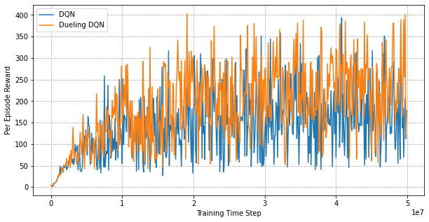
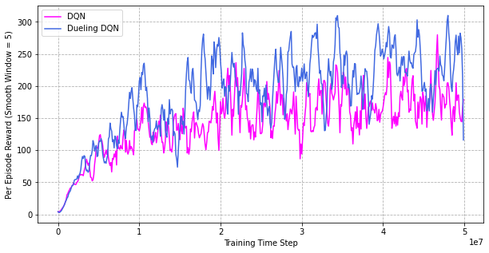

Dueling DQN for Breakout
================

Based on the Natural DQN for Atari Breakout implemented by [lukeluocn](https://github.com/lukeluocn/dqn-breakout), we modified the model according to paper [*Dueling Network Architectures for Deep Reinforcement Learning*](https://arxiv.org/abs/1511.06581) and reach a higher reward.

## Result

By running the code of Natural DQN and Dueling DQN to train an deep reinforcement learning agent who can play with Atari "Breakout" game for 50,000,000 timesteps, we can observe the per episode reward curves as shown in the figure below.

Due to the large fluctuation of per episode reward, it may be not that easy to distinguish the performance of two algorithms. In order to observe the curve better, we smooth the curve by using a average window. Results are as follows:

In evaluation phase, Dueling DQN reach a average reward of 425, while Natural DQN has only 354.

